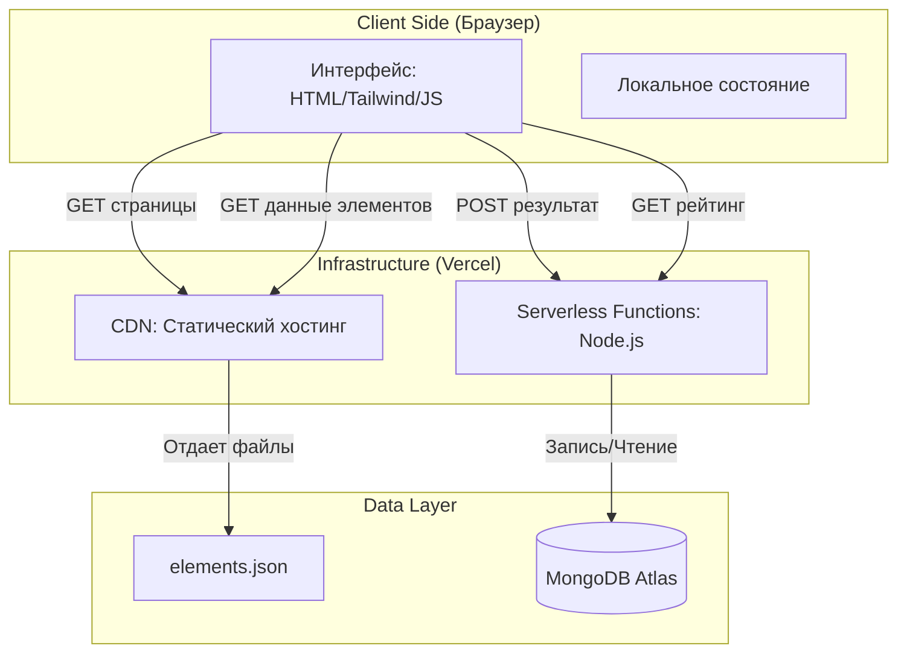
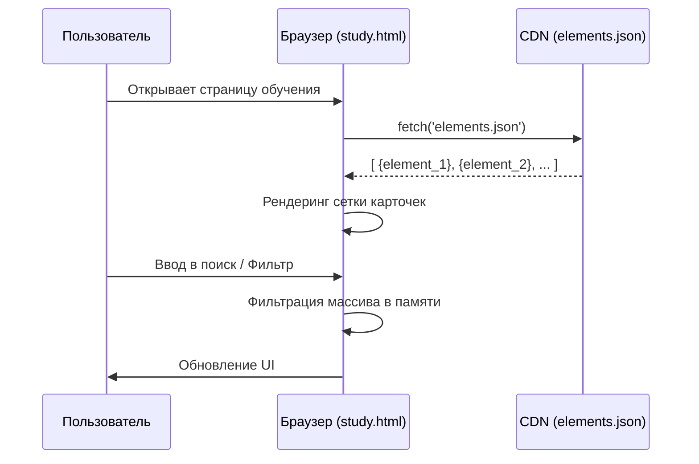
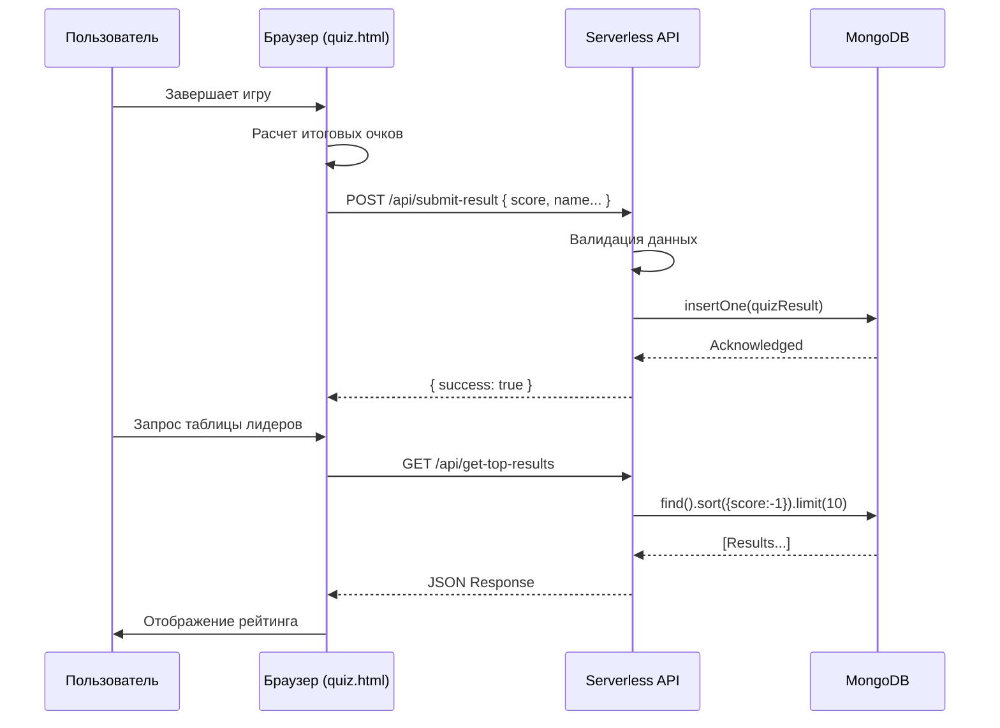

```markdown
# Архитектура проекта "ХИМИК"

## 📜 Обзор

Проект "ХИМИК" представляет собой интерактивный тренажер по химии, построенный по современной архитектуре **Serverless Jamstack**. Приложение разделено на статический фронтенд и легковесный бэкенд, взаимодействующий с облачной базой данных.

**Ключевой принцип:** Максимальное использование статических файлов для скорости и дешевизны, с подключением серверных функций только для динамических данных (рейтинг).

---

## 🏛 Высокоуровневая схема



---

## 🧩 Компоненты системы

### 1. Frontend (Презентационный слой)
**Технологии:** HTML5, CSS3 (Tailwind CSS), Vanilla JavaScript (ES6+).
**Среда:** Статический хостинг (Vercel CDN).

*   **`index.html`**: Landing page. Маршрутизация пользователя.
*   **`study.html`**: Режим обучения.
    *   **Источник данных:** `elements.json` (статический файл).
    *   **Логика:** Клиентская фильтрация, поиск, рендеринг карточек, модальные окна.
*   **`quiz.html`**: Игровой движок.
    *   **Логика:** Генерация вопросов, проверка ответов, подсчет очков, взаимодействие с API.
    *   **Состояние:** Хранится в памяти сеанса (`sessionStorage` для имени).
*   **`elements.json`**: База данных химических элементов в формате JSON. Выступает в роли "статического API".

### 2. Backend (Слой бизнес-логики)
**Технологии:** Node.js (Vercel Serverless Functions).
**Протокол:** HTTP REST API.

*   **`api/submit-result.js`**:
    *   **Метод:** `POST`
    *   **Назначение:** Прием и сохранение результатов игры.
    *   **Валидация:** Проверка типов данных, санитизация имени пользователя.
*   **`api/get-top-results.js`**:
    *   **Метод:** `GET`
    *   **Назначение:** Получение топ-10 результатов для таблицы лидеров.
    *   **Оптимизация:** Сортировка на стороне БД, проекция полей.

### 3. Database (Слой хранения)
**Технология:** MongoDB Atlas (NoSQL).

*   **Кластер:** `Cluster0` (или переменная окружения `MONGO_DB_NAME`).
*   **Коллекция:** `QuizResults`.
*   **Схема документа:**
    ```json
    {
      "_id": "ObjectId",
      "userName": "string (max 50 chars)",
      "score": "number",
      "correctAnswers": "number",
      "maxStreak": "number",
      "timestamp": "Date"
    }
    ```

---

## 🔄 Потоки данных

### Сценарий A: Изучение элементов (Read-Only)
Полностью клиентский сценарий. Серверная логика не задействована.



### Сценарий B: Прохождение викторины (Read/Write)
Взаимодействие с Serverless API и БД.



---

## ⚙️ Инфраструктура и развертывание

*   **Платформа:** Vercel.
*   **Деплой:** Автоматический триггер при `git push` в ветку `main`.
*   **Переменные окружения (Environment Variables):**
    *   `MONGO_URI`: Строка подключения к MongoDB Atlas (Secret).
    *   `MONGO_DB_NAME`: (Опционально) Имя базы данных.
*   **Кэширование:**
    *   Статические файлы кэшируются на уровне CDN.
    *   API-ответы не кэшируются (актуальные данные).

---

## 🛠 Технологический стек

| Категория | Технология | Обоснование выбора |
| :--- | :--- | :--- |
| **Frontend** | HTML, Tailwind CSS, JS | Простота, отсутствие сборки (build step), высокая производительность. |
| **Backend** | Node.js (Serverless) | Экономичность (pay-per-request), автоматическое масштабирование. |
| **Database** | MongoDB Atlas | Гибкая схема (NoSQL), бесплатный тариф, интеграция с JS. |
| **Hosting** | Vercel | Глобальный CDN, интеграция с Git, удобное управление Serverless. |
| **Data Format** | JSON | Нативный формат для JS, простота редактирования. |

---

## 🚀 Точки расширения

Архитектура позволяет легко добавлять новые функции:
1.  **Новые режимы:** Добавление новых HTML-файлов без изменений в бэкенде.
2.  **Развитие API:** Добавление файлов в папку `/api` создает новые эндпоинты автоматически.
3.  **Интеграции:** Возможность подключения сторонних сервисов (Auth0 для авторизации, Analytics) благодаря Serverless-подходу.
```
